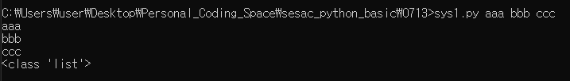

# 파이썬에서는 sys 모듈을 사용하여 매개변수를 직접 줄 수 있다.
- sys 모듈을 사용하려면, import sys 명령어를 사용해야 한다.

> 명령 프롬프트 명령어 [인수1 인수2 인수3 .....]

다음 예시의 결과값은 아래와 같다.
```python
import sys

args = sys.argv[1:] # 입력받은 인수를 리스트의 형태로 args에게 전송

for i in args:
    print(i)

print(type(args))
```



___

다음 예시의 결과값은 아래와 같다.
```python
import sys

args = sys.argv[:] # 이렇게 argv[1:]이 아닌 argv[:]을 쓰면, args[0]은 'sys2.py'가 된다. 주의!

for i in args:
    print(i.upper(), end=' ')
```


